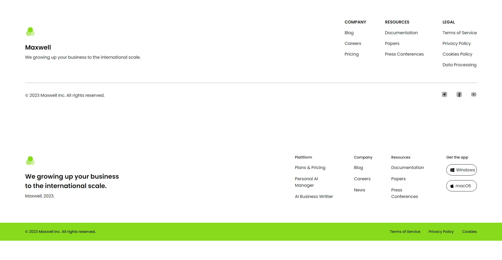

# Footer Light 🌐

Este proyecto presenta un mismo footer con  dos estilos diferentes realizado con Vite.

---

<div align="center">
  
</div>


---

## Tecnologías Utilizadas ⚙️

- [](src/index.html)
- [](src/sass/)


## Cómo Empezar 🚀

Sigue estos pasos para configurar y ejecutar el proyecto en tu entorno local:

1. **Clona el repositorio**:
   Abre tu terminal y ejecuta el siguiente comando para clonar el repositorio en tu máquina local:
   ```bash
   git clone https://github.com/israelinxy/footer-light.git
   ```

2. **Navega al directorio del proyecto**:
   Cambia al directorio del proyecto clonado:
   ```bash
   cd tu/repositorio
   ```

3. **Instala las dependencias**:
   Asegúrate de tener Node.js instalado y ejecuta el siguiente comando para instalar las dependencias necesarias:
   ```bash
   npm install
   ```

4. **Inicia el servidor de desarrollo**:
   Ejecuta el siguiente comando para iniciar el servidor de desarrollo y ver la aplicación en acción:
   ```bash
   npm run dev
   ```

5. **Abre tu navegador**:
   Una vez que el servidor esté en funcionamiento, abre tu navegador y visita `http://localhost:3000` (o la dirección que se muestre en la terminal) para ver la landing page.

6. **Abre el proyecto en tu editor de código**:
   Puedes abrir el directorio del proyecto en tu editor de código preferido. Por ejemplo, si usas Visual Studio Code, ejecuta:
   ```bash
   code .
   ```
   Esto abrirá el proyecto en VS Code, permitiéndote ver y editar los archivos.

Con estos pasos, deberías poder comenzar a trabajar con el proyecto sin problemas. ¡Disfruta desarrollando! 🚀💻

## Contribuciones 🤝

Las contribuciones son bienvenidas. Para problemas, ideas o nuevas características, por favor abre un issue o un pull request.

## Contacto 📫

¿Necesitas un diseño web personalizado? Contáctame:

[](mailto:israelcolladom@gmail.com)

## Licencia 📜

Este proyecto está bajo la licencia [MIT](LICENSE).
